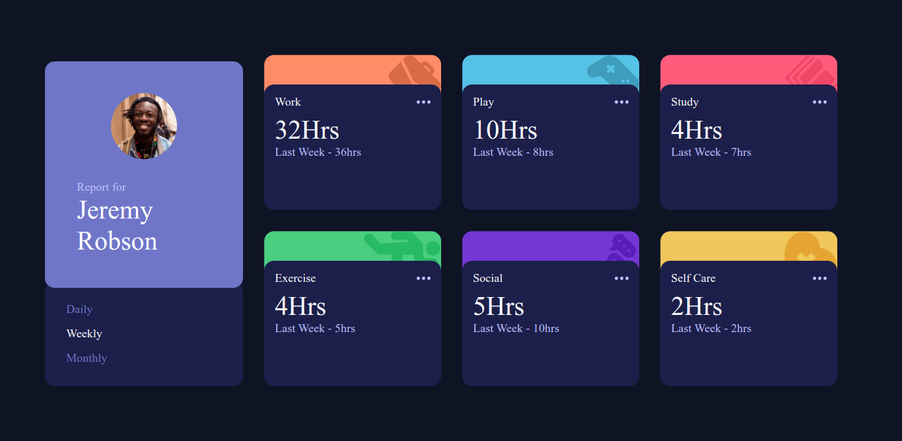

# Time tracking dashboard solution

## Overview

### The Project

Users should be able to:

- View the optimal layout for the site depending on their device's screen size
- See hover states for all interactive elements on the page
- Switch between viewing Daily, Weekly, and Monthly stats

### Links

- Live Site URL: [Time tracking dashboard](https://time-tracking-dashboard-orlando.netlify.app/)

## My process

### Built with

- Semantic HTML5 markup
- CSS custom properties
- Flexbox
- CSS Grid
- Mobile-first workflow

## Author

- Website - [Orlando Leyva](https://orlando-leyva-portfolio.netlify.app/)
